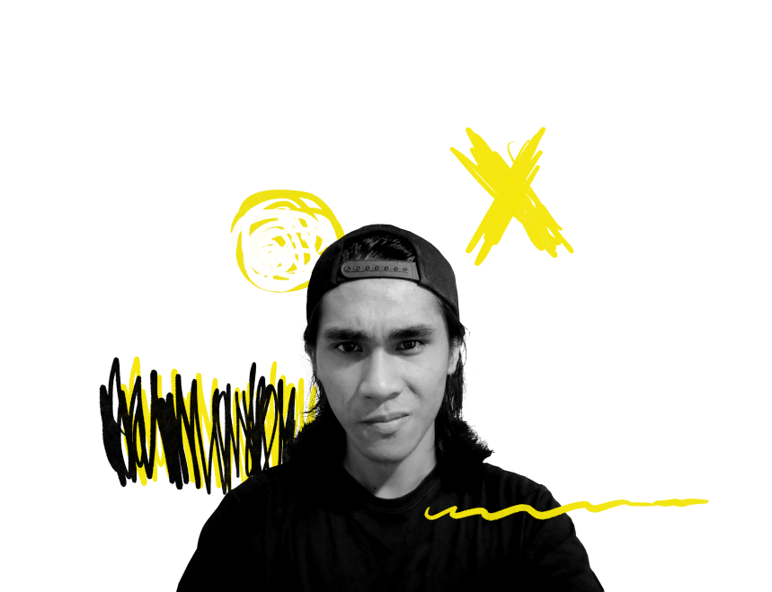

  About <i class="fas fa-address-card"></i>

<aside>
  

    
    
Reza Fauzi Zisiwa Duha

  

</aside>

<section>

Hello, I am Reza, Programmer based in Indonesia. My expertise areas span from Human-Computer Interaction, UI, Frontend Web Development and Android Development.
  
I’m pretty busy at college, but I’d be happy to hear from you if you have an interesting idea for a collaboration or if you just want to <a href="mailto:rezafauzizisiwaduha@gmail.com">Say hi.</a>

<section>

 

<strong>Click here to view a bullet-list representation of me.</strong>

### SKILLS <i class="fas fa-hat-wizard"></i>

- **Development:** HTML5, XML, CSS, JavaScript, JAVA, Android Native
- **Tools:** Git, NPM, Webpack, JAMstack (static sites, on Netlify), Ember.js, Bootstrap, Android SDK
- **Design:** GIMP, Photoshop
- **Motion Design:** Lightworks, Adobe Premiere

### EXPERIENCE <i class="fas fa-layer-group"></i>

### EDUCATION <i class="fas fa-user-graduate"></i>

- **2018-now:** Bachelor of Computer Science at Immanuel Christian University (Undergraduate)
- **2015-2018:** Bintang Laut Catholic Private High School

### CERTIFICATE <i class="fas fa-certificate"></i>

Belajar Membuat Aplikasi Android untuk Pemula

- _By_ : Google ATP
- _Organizer_ : Dicoding
- _Level_ : Beginner
  <a href="https://www.dicoding.com/certificates/J1RXYV2G3XVM" target="_blank">See credentials</a>

Belajar Fundamental Aplikasi Android

- _By_ : Google ATP
- _Organizer_ : Dicoding
- _Level_ : Intermediate
  <a href="https://www.dicoding.com/certificates/Y6RPNNYLRP2M" target="_blank">See credentials</a>

Belajar Dasar Pemrograman Web

- _By_ : Dicoding Indonesia
- _Organizer_ : Dicoding
- _Level_ : Basic-Beginner
  <a href="https://www.dicoding.com/certificates/Y6RPN2958Z2M" target="_blank">See credentials</a>

Belajar Fundamental Front-End Web Development

- _By_ : Dicoding
- _Organizer_ : Dicoding
- _Level_ : Beginner-Intermediate
  <a href="https://www.dicoding.com/certificates/ON9ZOVERYPG5" target="_blank">See credentials</a>

Basic Programming Class of ALE Geek Battle

- _By_ : Alcatel-Lucent Enterprise
- _Organizer_ : Dicoding
- _Level_ : Basic
  <a href="https://geekbattle.al-enterprise.co.id/assets/files/Sertifikat/Sertifikat2-264.pdf" target="_blank">See credentials</a>

Expert Programming Class of ALE Geek Battle

- _By_ : Alcatel-Lucent Enterprise
- _Organizer_ : Dicoding
- _Level_ : Expert
  <a href="https://geekbattle.al-enterprise.co.id/assets/files/Sertifikat/Expert/ExpertCertificate-42.pdf" target="_blank">See credentials</a>

Android Certificate from Digital Talent Scholarship

- _By_ : Ministry of Communication and Informatics
- _Organizer_ : Digital Talent Scholarship
- _Level_ : Beginner

### LANGUAGES <i class="fas fa-language"></i>

- **Indonesian**
- **English**

### INTERESTS <i class="fas fa-play-circle"></i>

- **Daily intake:** tea, music, books, video games, movies, and T.V. shows
- **Music:** playing guitar, drums or all kinds of other percussion instruments
- **Sport:** Soccer, table tennis

### ON THE WEB <i class="fas fa-globe"></i>

- [LinkedIn: rezaduha](https://id.linkedin.com/in/reza-duha-57a98b192)
- [GitHub: rezaduha](https://github.com/rezaduha)

 

`Email: rezafauzizisiwaduha@gmail.com`

